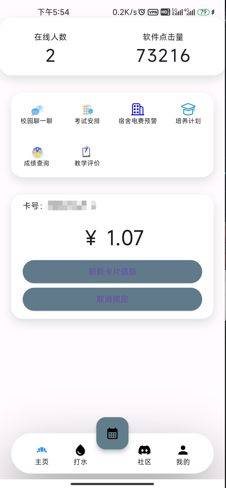
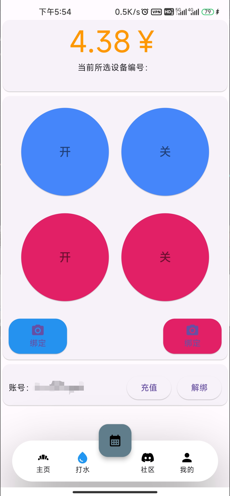
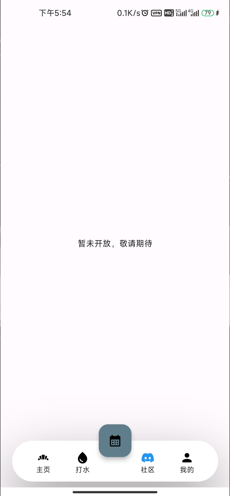
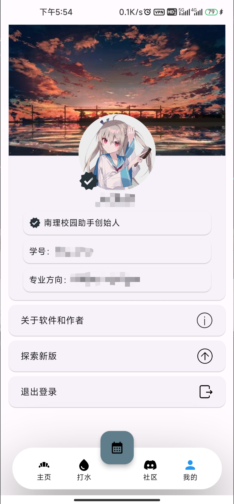
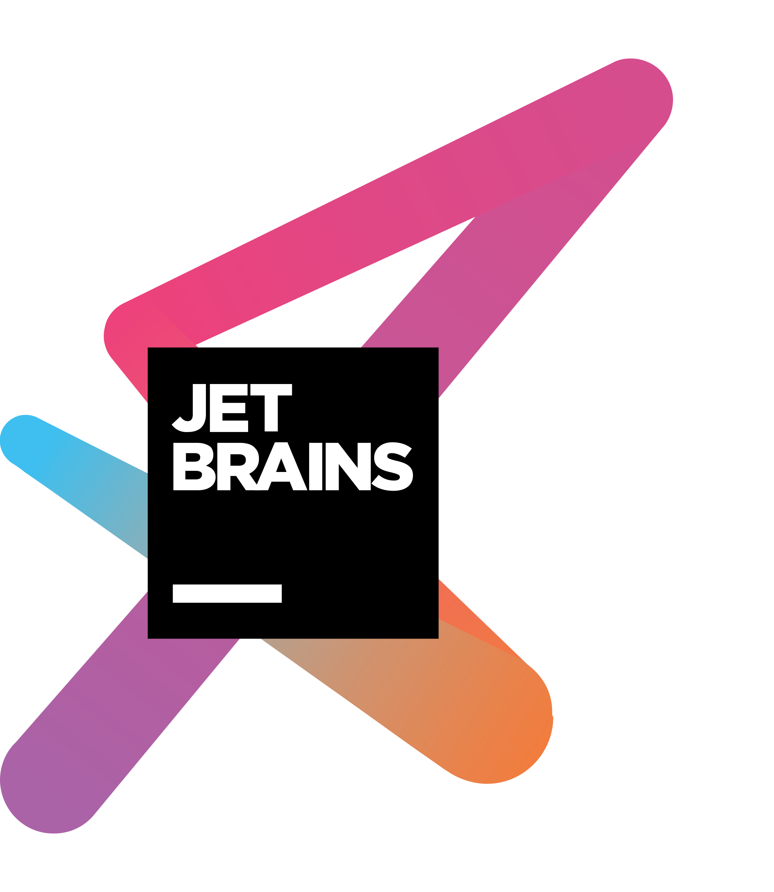

<div align="center">

# 校园助手 NNLG

基于 Flutter 开发的第三方校园综合服务 App，为南宁理工学院学子提供课表、成绩、考试、打水等一站式服务。

[](https://flutter.dev)
[](https://www.android.com)
[](./pubspec.yaml)
[](https://github.com/Changbaiqi/NNLG/stargazers)
[](https://github.com/Changbaiqi/NNLG/network/members)

</div>

---

## 📖 简介

**校园助手（NNLG）** 是一款使用 Flutter 构建的跨平台校园工具类应用，整合了教务查询、饮水机服务、校园社区等功能，支持 Material You 动态取色与多主题切换。

## ✨ 功能板块

| 模块 | 说明 |
| ---- | ---- |
| 🏠 **主页** | 聚合常用功能入口，快速访问各项服务 |
| 📅 **课程表** | 课表展示与课程管理，支持桌面小组件（Home Widget） |
| 💧 **打水** | 饮水机定位（Wi-Fi AP + GPS）、扫码打水、余额查询 |
| 🎓 **成绩 / 考试** | 成绩查询、考试安排查询、教学评价 |
| 👥 **社区**（待开发） | 校园社区交流板块 |
| 👤 **我的** | 个人信息、主题设置、数据导入导出等 |

### 界面预览

| 主页 | 打水 |
| :---: | :---: |
|  |  |
| **社区（待开发）** | **我的** |
|  |  |

## 🛠 采用技术

| 技术 | 用途 |
| ---- | ---- |
| Flutter / Dart | 跨平台 UI 框架 |
| Android 原生 | 桌面小组件、平台通道 |
| JavaScript | Web 模块脚本 |
| GetX | 状态管理与路由 |
| Dio | 网络请求 |
| Floor / sqflite | 本地数据库 ORM |
| WebSocket | 实时通信 |

<details>
<summary><b>主要依赖清单</b>（点击展开）</summary>

- **网络**：dio、web_socket_channel、url_launcher
- **存储**：shared_preferences、sqflite、floor、path_provider
- **UI**：dynamic_color（Material You）、flutter_svg、lottie、flutter_markdown、flutter_screenutil
- **扫码**：flutter_hms_scan_kit（扫码）、qr_flutter（生成）
- **多媒体**：audioplayers、image_picker、image_gallery_saver_plus
- **其他**：fluwx（微信支付）、tencent_kit（QQ 分享）、geolocator、wifi_hunter、home_widget、showcaseview

</details>

## 🚀 快速开始

### 环境要求

- Flutter SDK ≥ 3.x（Dart ≥ 2.17）
- Android Studio / VS Code
- Android SDK（编译 Android 端）

### 构建步骤

```bash
# 1. 克隆项目
git clone https://github.com/Changbaiqi/NNLG.git
cd NNLG

# 2. 安装依赖
flutter pub get

# 3. 生成代码（Floor / JSON 序列化）
flutter pub run build_runner build --delete-conflicting-outputs

# 4. 运行
flutter run
```

> ⚠️ **注意**：编译项目时需修改 `gradlew.bat` 中的
> `set GRADLE_OPTS="-Dgradle.user.home=D:/.gradle"`
> 将其中的路径改为你本机的 Gradle 目录。

### 打包发布

```bash
flutter build apk --release
```

## 📂 项目结构

```
lib/
├── main.dart          # 入口
├── view/              # 页面视图（主页、课表、打水、社区、我的等）
├── dao/               # 数据库访问层
├── entity/            # 实体类
├── element/           # 通用组件
├── theme/             # 主题配置
├── utils/             # 工具类
└── web/               # Web 相关
```

## 🤝 参与贡献

欢迎提交 Issue 与 Pull Request！

1. Fork 本仓库
2. 创建特性分支：`git checkout -b feature/xxx`
3. 提交更改：`git commit -m "feat: xxx"`
4. 推送分支：`git push origin feature/xxx`
5. 提交 Pull Request

## ⭐ Star History

[](https://starchart.cc/Changbaiqi/NNLG)

## 🙏 鸣谢

> 感谢 [**JetBrains**](https://www.jetbrains.com/zh-cn/community/opensource/#support) 提供的开源开发许可证。JetBrains 通过为核心项目贡献者免费提供一套一流的开发者工具来支持非商业开源项目。

<div align="center">

</div>
