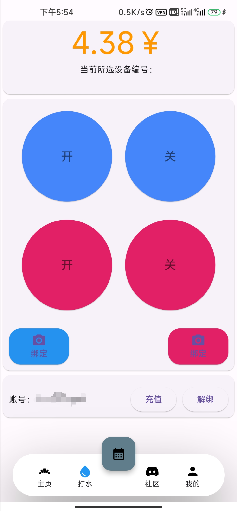

# 南理校园助手

---

## 采用技术

* Android原生
* Flutter 
* JavaScript
* 编译项目时记得修改gradlew.bat中的set GRADLE_OPTS="-Dgradle.user.home=D:/.gradle"。将其中的路径改为你的gradle目录

## 功能板块

### 主页

### 打水

### 社区（待开发）

### 我的

## 鸣谢

> 感谢[**JetBrains**](https://www.jetbrains.com/zh-cn/community/opensource/#support)提供的开源开发许可证，JetBrains 通过为核心项目贡献者免费提供一套一流的开发者工具来支持非商业开源项目。
>
> 

