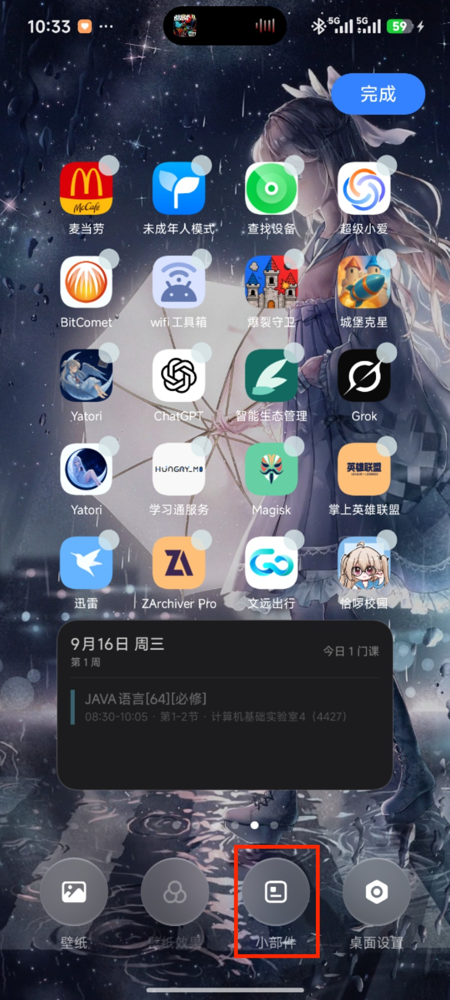
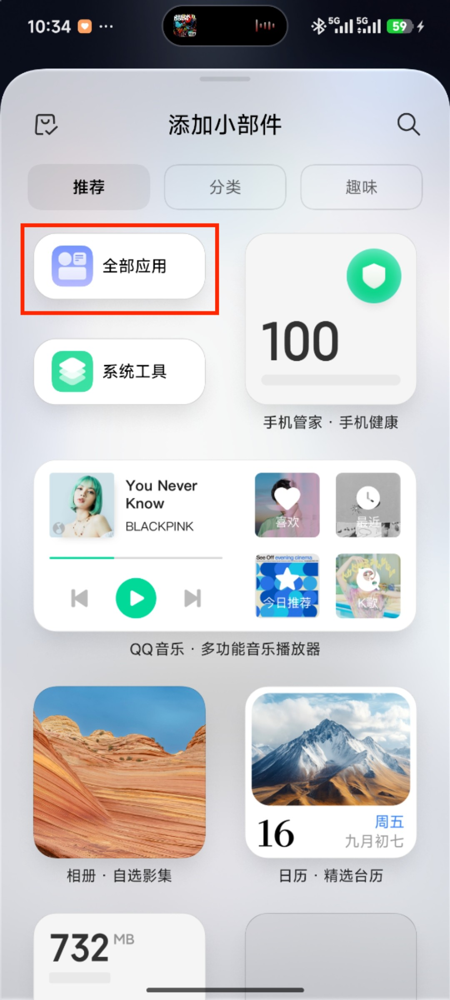
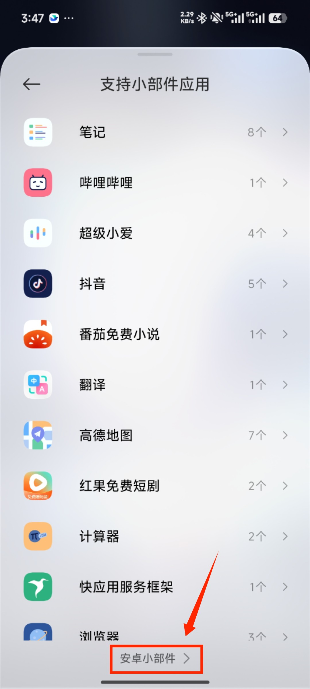
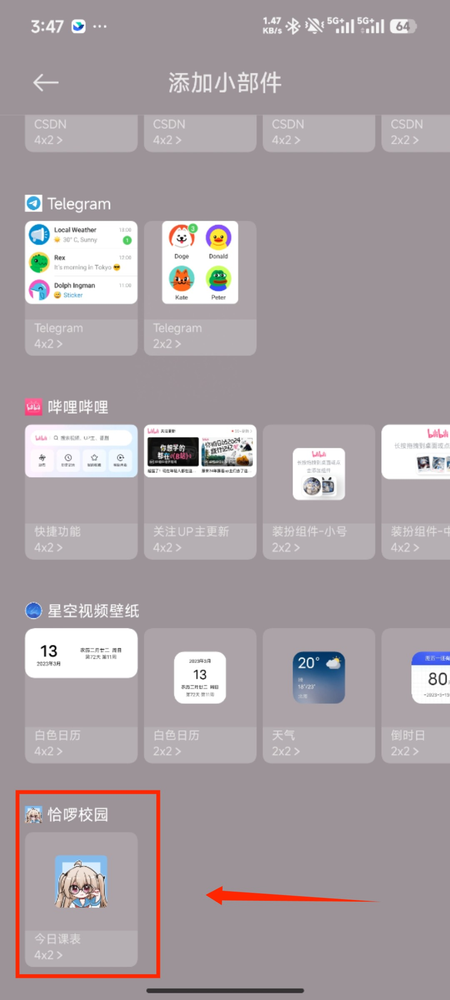
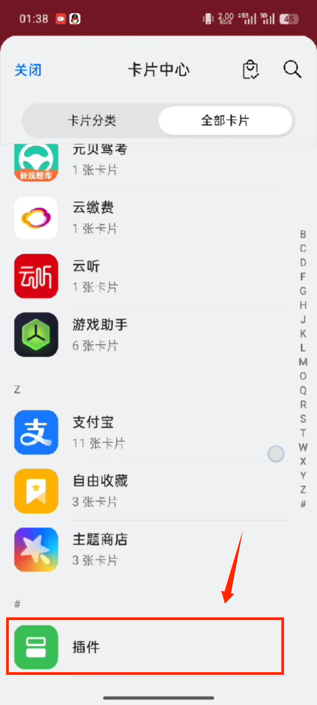

# 添加课表小组件到桌面（小米手机为例）
一般来说需要手动添加小组件的情况是手机不支持自动添加小组件，这个时候就需要手动添加，这里以小米手机为例。

## 第一步，长按桌面
长按桌面空白部分后会出现一个添加小组件的按钮在下面，点进去。

## 第二步，选择全部应用
点进去后，这里选择“全部应用”，如下图：

## 第三步，选择安卓小部件
小米的话藏的比较深，这个是小米手机系统自身原因（说白了就是小米想捞钱，你会发现一开始那些小组件全是付费的）。

## 第三步，找到恰啰校园图标的组件
这里自行从这个列表里面翻找即可，找到后添加到桌面即可。

## OPPO系列手机注意
OPPO系列手机的话是在卡片中心，然后一直滑到最底部会有个“插件”，点击进去里面才会有对应课表小组件：
