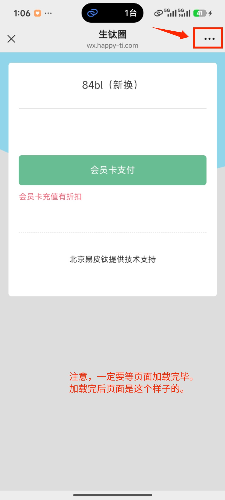
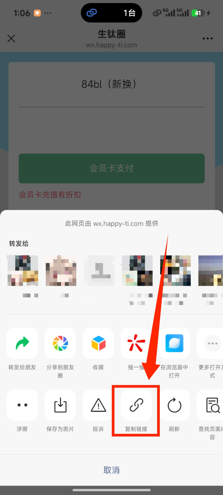
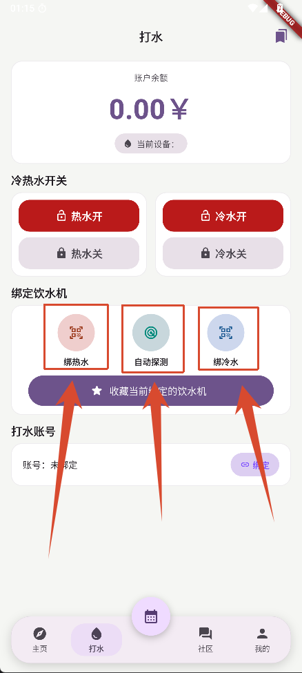

### 一、绑定账号
* 首先，用微信随机扫描一台热水机的二维码；
* 待页面加载完毕后（注意，一定要加载完毕。如下截图），然后点击微信右上角点击“三个点”的按钮然后选择复制链接；

* 然后将复制好的链接粘贴到账号绑定的输入框内，然后点击“确定”按钮等待绑定成功即可。

注：绑定账号后以后就不用再绑定账号了，软件会一直保存，除非你需要切换其他账号。

### 二、绑定饮水机冷热水
绑定饮水机的操作有两种：
* 第一种是直接点击中间的“自动探测饮水机”按钮，这种方式需要你有将当前的饮水机加入到过收藏。
* 第二种是通过点击界面上的绑定冷热水按钮进行扫码绑定，这种每次绑定后你下次打开软件都会一直存在除非你需要换其他饮水机才需要另外扫码。

